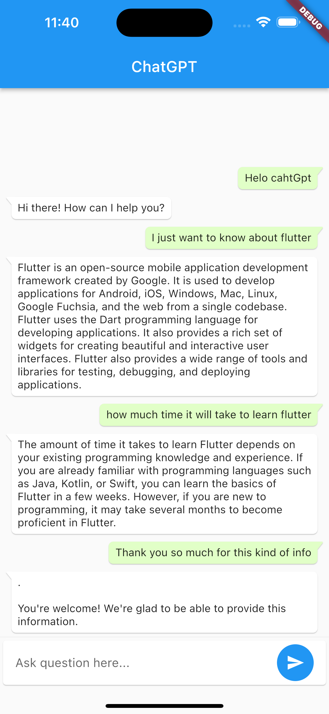

# Flutter Chat GPT
A sample Flutter app that demonstrates the use of OpenAI's GPT-3 API to generate text.

## Demo

### :star: Star me on GitHub — it helps!

## Features
- User input to generate text using GPT-3 API
- Customizable settings for API parameters
- User can copy the generated text to clipboard
- Natural language understanding
- Human-like conversation
- Lightweight, easy to integrate with other apps
- Open-source

## Prerequisites
- Flutter SDK
- API key for OpenAI GPT-3 [Available here](https://beta.openai.com/account/api-keys)

## Getting Started

1. Clone the repository
2. Run `flutter pub get` to install dependencies
3. Replace the placeholder API key with your own in the `AppConstants` file
4. Run the app on an emulator or physical device

### Development by

- OpenAI - https://openai.com
- Flutter - https://flutter.dev/

Please open an issues on the repository if you find any bugs or if you would like to contribute.
